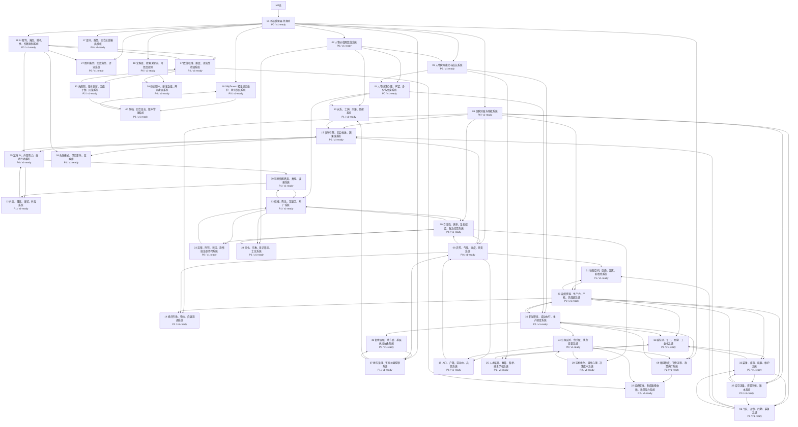

# 模块依赖图

本图由 `scripts/generate_module_index.py` 生成，用于快速查看 41 个模块之间的依赖。

## 模块索引

| ID | 模块 | 分类 | 优先级 | 状态 | 依赖 |
|---|---|---|---|---|---|
| 01 | 崇祯模拟器 总规则 | 总规则 | P0 | v1-ready | 0无 |
| 02 | 人物价值观数值系统 | 人物系统 | P0 | v1-ready | 01 |
| 03 | 人物实际能力与成长系统 | 人物系统 | P0 | v1-ready | 01, 02 |
| 04 | 人物决策心理、声望、身份与信息系统 | 人物系统 | P0 | v1-ready | 02, 03 |
| 05 | 国家财政与税收系统 | 国家与世界系统 | P0 | v1-ready | 01 |
| 06 | 军队、战役、后勤、装备系统 | 国家与世界系统 | P0 | v1-ready | 05, 32, 33 |
| 07 | 地方治理、省府州县控制系统 | 国家与世界系统 | P1 | v1-ready | 01, 41 |
| 08 | 灾荒、气候、瘟疫、民变系统 | 国家与世界系统 | P0 | v1-ready | 05, 07, 19, 20 |
| 09 | 朝廷制度、官僚流程、政策执行系统 | 国家与世界系统 | P2 | v1-ready | 01, 31, 34 |
| 10 | 派系、士绅、宗藩、商帮系统 | 国家与世界系统 | P1 | v1-ready | 02, 04, 07 |
| 11 | 科技树、军工、西学、工业化系统 | 国家与世界系统 | P0 | v1-ready | 25, 26, 31, 32 |
| 12 | 外交、藩属、海贸、外夷系统 | 国家与世界系统 | P1 | v1-ready | 35, 39 |
| 13 | 情报、舆论、锦衣卫、东厂系统 | 国家与世界系统 | P1 | v1-ready | 04, 20, 23, 39 |
| 14 | 经济市场、物价、白银流通系统 | 国家与世界系统 | P2 | v1-ready | 05, 08, 26 |
| 15 | 事件引擎、回合推进、因果链系统 | 运行与元规则 | P0 | v1-ready | 05, 06, 08, 10, 35 |
| 16 | SillyTavern 轻量记忆维护、状态快照系统 | 运行与元规则 | P0 | v1-ready | 01, 40 |
| 17 | 诏书、政策、回合总结输出模板 | 运行与元规则 | P0 | v1-ready | 01 |
| 18 | 史料库、检索关键词、可信度规则 | 运行与元规则 | P0 | v1-ready | 01 |
| 19 | 人口、户籍、劳动力、兵源系统 | 社会底盘系统 | P1 | v1-ready | 08, 34 |
| 20 | 合法性、天命、皇权威望、政治信用系统 | 社会底盘系统 | P1 | v1-ready | 05, 08, 13 |
| 21 | 地图空间、交通、距离、补给线系统 | 社会底盘系统 | P1 | v1-ready | 06, 08, 26 |
| 22 | 组织惯性、制度路径依赖、改革阻力系统 | 社会底盘系统 | P2 | v1-ready | 09, 34, 37 |
| 23 | 法律、刑罚、司法、恐怖统治副作用系统 | 社会底盘系统 | P2 | v1-ready | 13, 20 |
| 24 | 文化、宗教、意识形态、士论系统 | 社会底盘系统 | P2 | v1-ready | 02, 13, 20 |
| 25 | 人才培养、教育、科举、技术学校系统 | 社会底盘系统 | P1 | v1-ready | 03, 11 |
| 26 | 自然资源、生产力、产能、供应链系统 | 社会底盘系统 | P0 | v1-ready | 05, 21, 31, 33 |
| 27 | 胜利条件、失败条件、评分系统 | 目标、裁判与玩家系统 | P2 | v1-ready | 01, 28 |
| 28 | AI 裁判、难度、随机性、作弊限制系统 | 目标、裁判与玩家系统 | P0 | v1-ready | 01, 37 |
| 29 | 玩家角色、皇帝心理、决策成本系统 | 目标、裁判与玩家系统 | P2 | v1-ready | 20, 34 |
| 30 | 元规则、版本更新、数值平衡、回滚系统 | 目标、裁判与玩家系统 | P2 | v1-ready | 37 |
| 31 | 职位职责、自动执行、生产调度系统 | 自动运行与落地系统 | P0 | v1-ready | 03, 04, 09, 26 |
| 32 | 装备、库存、损耗、维护系统 | 自动运行与落地系统 | P0 | v1-ready | 06, 11, 26, 33 |
| 33 | 库存流量、资源守恒、账本系统 | 自动运行与落地系统 | P0 | v1-ready | 05, 26, 32 |
| 34 | 任务队列、优先级、执行容量系统 | 自动运行与落地系统 | P0 | v1-ready | 29, 31 |
| 35 | 敌方 AI、外部势力、自动行动系统 | 自动运行与落地系统 | P0 | v1-ready | 12, 15, 28 |
| 36 | 初始剧本、基准数值、开局盘点系统 | 自动运行与落地系统 | P0 | v1-ready | 18, 37 |
| 37 | 数值校准、难度、现实性检查系统 | 自动运行与落地系统 | P2 | v1-ready | 28, 30 |
| 38 | 失败模式、风险事件、反噬库 | 自动运行与落地系统 | P1 | v1-ready | 15, 28 |
| 39 | 玩家情报界面、奏报、误报系统 | 自动运行与落地系统 | P1 | v1-ready | 13, 35 |
| 40 | 存档、回合日志、版本管理系统 | 自动运行与落地系统 | P2 | v1-ready | 16, 30 |
| 41 | 官僚层级、地方官、基层执行抽象系统 | 自动运行与落地系统 | P0 | v1-ready | 07, 31 |
